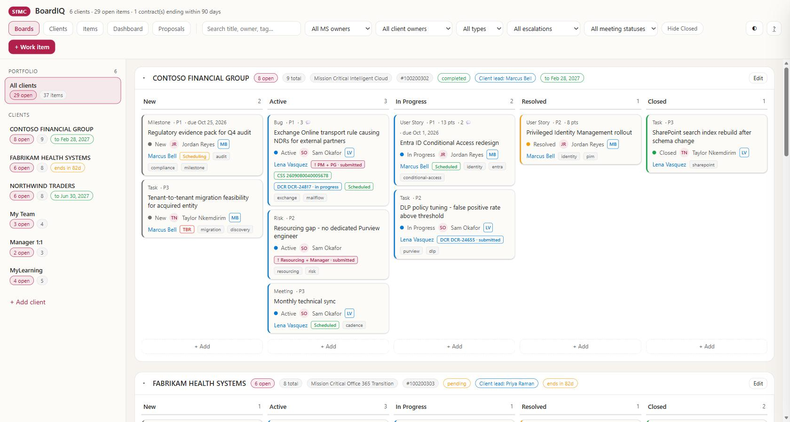

# SfMC:BoardIQ

A self-hosted delivery board for every engagement you own — customer or internal —
that keeps itself current by reading your mail and Teams and **proposing** changes
for you to approve.

Runs entirely on your machine: one Python file, standard library only, no database,
no service, bound to `127.0.0.1`.

This repository ships with **fictitious demo data** (Contoso, Northwind, Fabrikam),
so a fresh clone is immediately runnable and safe to screen-share.

> **Here for a hackathon?** Jump to [`docs/HACKATHON.md`](docs/HACKATHON.md) — four
> runnable prompts, each with a one-command reset.



---

## Contents

1. [Set up on a brand new machine](#1-set-up-on-a-brand-new-machine)
2. [Set up Microsoft Scout](#2-set-up-microsoft-scout)
3. [Daily use](#3-daily-use)
4. [The demo data](#4-the-demo-data)
5. [Configuration — `instance.json`](#5-configuration--instancejson)
6. [Keeping up with an upstream board](#6-keeping-up-with-an-upstream-board)
7. [The presentation](#7-the-presentation)
8. [Files](#8-files)
9. [Publishing as a private repository](#9-publishing-as-a-private-repository)
10. [Before you present](#10-before-you-present)
11. [Packaging for your team](#11-packaging-for-your-team)

---

## 1. Set up on a brand new machine

### Requirements

| | |
|---|---|
| OS | Windows 10/11 (PowerShell 7 recommended) |
| Python | 3.9+ — **standard library only**, nothing to `pip install` |
| Browser | any modern one |
| Microsoft Scout | optional, but needed for the automation in [section 2](#2-set-up-microsoft-scout) |

Confirm Python is on PATH:

```powershell
python --version
```

> If that opens the Microsoft Store, you have the WindowsApps execution alias
> rather than a real interpreter. Install Python from python.org, or disable the
> alias under **Settings → Apps → Advanced app settings → App execution aliases**.
> The watchdog resolves the real interpreter itself, but a working `python` on PATH
> makes everything simpler.

### Run it

**Easiest — double-click `Start.cmd`.** It clears Mark of the Web on this folder,
checks Python, and starts the server with a visible console.

Or from a terminal:

```powershell
cd "C:\GitHub\SfMC-BoardIQ"
Get-ChildItem -Recurse -File | Unblock-File   # only after extracting a .zip
.\Start-Boards.ps1
```

That starts the server in the foreground with a console — good for a first run,
because you see any error. Open <http://127.0.0.1:8791>.

You should see **6 clients / 37 items**. If you do, everything works.

> **Sharing this with someone else?** Hand them the packaged `.zip` (see
> [section 11](#11-packaging-for-your-team)) rather than a copy of this folder. It
> contains a browser-based install guide at `docs\INSTALL.html` written for someone
> who has never seen the project.

### Keep it running without a terminal

```powershell
.\Install-Autostart.ps1
```

This registers a Scheduled Task (named from `instance.json` → `taskName`) that:

- starts the server at logon,
- re-checks every 5 minutes and restarts it if it stopped,
- runs hidden — no console window, and **Scout does not need to be open**.

Manage it with:

```powershell
.\Watchdog.ps1 -Status     # is it up?
.\Watchdog.ps1             # start if down
.\Watchdog.ps1 -Restart    # stop and start fresh
.\Install-Autostart.ps1 -Status
.\Install-Autostart.ps1 -Remove
```

> **Only one copy of this folder may run at a time.** Every copy declares
> `"port": 8791`, and the server deliberately refuses to double-bind a port — two
> servers sharing one port silently split requests between them, which is very
> confusing to debug. To run a second copy for development, give it a different
> `port` **and** `taskName` in `instance.json`, or start it ad hoc:
>
> ```powershell
> python server.py --port 8799 --no-browser
> ```

---

## 2. Set up Microsoft Scout

The board works fine on its own — you can add and move items by hand. What Scout
adds is the part that saves the time: a daily read of your mail and Teams that
**proposes** board changes and waits for your approval.

Everything needed is in [`exports\`](exports/README.md):

| File | What it is |
|---|---|
| `exports\automations\board-proposals.json` | Scheduled automation — weekday morning scan that queues proposals |
| `exports\skills\client-scan\SKILL.md` | The same logic as `/client-scan`, on demand |

### Import both

Start a Scout session **in this folder** and paste:

```
Read exports\automations\board-proposals.json and create that automation with
m_create_automation, using the name, description, model, schedule, triggerType,
teamsNotify and prompt exactly as written. Replace <YOUR-BOARD-FOLDER> with the
absolute path of this repo folder. Leave it disabled.

Then read exports\skills\client-scan\SKILL.md and create a skill named
"client-scan" with m_create_skill, using the description under
"Description (for m_create_skill)" and everything under "## Instructions" as the
instructions. Replace <YOUR-BOARD-FOLDER> the same way.

Confirm both were created and show me the automation id.
```

The automation is imported **disabled** on purpose. Enable it once you have
confirmed the board answers and you are happy for it to read your mail:

```
Enable the SfMC-BoardIQ Board Proposals automation.
```

### The guarantee

Neither the automation nor the skill can write to a board. They only POST to
`/api/proposals`; the last line of both prompts is
`NEVER call POST/PUT/DELETE on {API}/items`. Every change is applied by a human on
the **Proposals** page, which shows the proposed item side by side with whatever it
would change, field by field.

### Trying it against demo data

The demo clients are fictitious, so a real scan finds nothing for them — and
reporting zero is correct, not a failure.
[`exports\README.md`](exports/README.md#trying-it-against-demo-data) has a
copy-paste snippet that seeds two sample proposals so you can walk the whole review
loop without touching a mailbox.

---

## 3. Daily use

| Tab | What it is for |
|---|---|
| **Boards** | Kanban per client. Drag between columns; every chip on a card answers a question you would otherwise have to open the item to ask |
| **Clients** | Add clients, set the client lead, set `searchTerms`, request a scan |
| **Items** | Flat sortable list of everything — filter, multi-select, bulk archive/delete |
| **Dashboard** | New vs closed over 7/15/30/90/120/180 days, ageing, escalation load, overdue, meetings still to book |
| **Proposals** | Review queue — current item vs proposed, with Add/Apply · Skip · Archive · Delete |

Documentation is served in-app at <http://127.0.0.1:8791/readme>, or press **?** in
the toolbar.

### Adding a client

**Clients → + Add client.** On save the app derives `searchTerms` from the name and
queues a first-pass scan. **Review those search terms** — an organisation often
files support cases under an operating-company name that differs from its display
name, and the derived guess will miss those. This one field decides whether the
scan finds the work or silently returns nothing.

Leave `scanEnabled` off for internal boards; a "My Team" board has no mail to read.

---

## 4. The demo data

All companies, people, case numbers and dates are **invented**. The company
names are Microsoft's standard fictitious brands so they cannot be mistaken for
a real customer.

| Client | Items | What it demonstrates |
|---|---|---|
| CONTOSO FINANCIAL GROUP | 9 | Heaviest escalation load — CSS case, two DCRs, a resourcing escalation, a `TBR` meeting |
| FABRIKAM HEALTH SYSTEMS | 8 | Contract **ending inside 90 days** (amber countdown), a `PG` escalation on hold, a stalled cadence |
| NORTHWIND TRADERS | 8 | Healthy delivery — a live migration, one P1 bug, work spread across all five columns |
| My Team | 4 | Internal workstream |
| Manager 1:1 | 3 | Running 1:1 agenda, incl. an escalation to Manager |
| MyLearning | 5 | Certifications and labs |

Items are dated across ~145 days so the **Dashboard trend charts have real
shape** at every window (7d → 180d), and six closures fall inside the last
30 days so the "Closed" series is never flat.

### Resetting the demo

```powershell
python seed_demo.py       # rewrites data\store.json from scratch
.\Watchdog.ps1 -Restart
```

Run this after a live demo where you dragged cards around. It is deterministic
(fixed random seed), so the demo looks the same every time — except that dates
are always relative to *today*, so the data never looks stale.

---

## 5. Configuration — `instance.json`

The only file that makes this deployment different:

```json
{
  "name": "SfMC:BoardIQ",
  "logo": "SfMC",
  "title": "BoardIQ",
  "port": 8791,
  "taskName": "SfMC-BoardIQ (demo)",
  "pinnedBottom": ["my-team", "manager-1-1", "mylearning"],
  "adoEnabled": false,
  "demo": true
}
```

| Key | Effect |
|---|---|
| `name` | Browser title, console output, watchdog messages, README header |
| `logo` / `title` | The badge and heading in the top-left of the app |
| `port` | Default port for `server.py`, `Watchdog.ps1`, `Start-Boards.ps1` |
| `taskName` | Scheduled task name — must be unique per instance |
| `pinnedBottom` | Client ids forced to the bottom of the rail, in this order; everything else sorts alphabetically |
| `adoEnabled` | `false` hides the **Sync ADO** button |
| `demo` | Adds `is-demo` to `<body>` for any future demo-only styling |

Because the ports differ, each instance is a distinct browser origin and therefore
gets its own **`localStorage`** — selected client, theme and filters never leak
between instances, with nothing to configure.

---

## 6. Keeping up with an upstream board

This repository is a self-contained deployment, but its code is shared with an
upstream board that holds real data. Two scripts move things between them.

### `Export-Repo.ps1` — the full refresh

One command: pull the latest code, regenerate the demo data, rebuild the deck,
**verify nothing real is about to be published**, and mirror to the repo folder.

```powershell
.\Export-Repo.ps1                     # full run
.\Export-Repo.ps1 -WhatIf             # report only, change nothing
.\Export-Repo.ps1 -NoReseed           # keep the current demo data
.\Export-Repo.ps1 -NoDeck             # skip the slow deck rebuild
.\Export-Repo.ps1 -Target "D:\repo"   # export somewhere else
```

| Step | What it does |
|---|---|
| 1 | Copies the shared code files from the upstream board |
| 2 | Runs `seed_demo.py` — dates land relative to today, so the demo never looks stale |
| 3 | Runs `build_overview.py` |
| 4 | **Safety scan** — see below |
| 5 | `robocopy /MIR` to the target, excluding backups, logs, `__pycache__` and `.git` |

Exit codes: **0** exported · **2** blocked by the safety scan.

#### The safety scan

Step 4 is the reason this script exists. It builds a blocklist and refuses to
publish if any term appears in the files about to be exported:

- **Derived from the upstream board** — every real client name, every comma-separated
  value in their `searchTerms`, every client lead and contact, every case and DCR id,
  read live from that board's `store.json`. It therefore stays correct as clients are
  added, with no list to maintain.
- **Plus `.export-blocklist`** — a local file for things that live outside the board:
  usernames, mail domains, and operating names a client files cases under. This file
  is deliberately **excluded from the export and from git**, both because it names the
  very things that must stay private and because keeping it out stops the scanner from
  matching its own blocklist.

A hit prints the file, line and surrounding text, and stops before the mirror runs.
`-Force` overrides it — only for genuine false positives, and read the finding first.

> This is not theoretical. Its first real run caught a customer contact's real name
> hardcoded as an example `placeholder` in `app\app.js` — shared code, one command
> away from a public repository.

### `Update-FromSfMC.ps1` — code only

When you just want the latest features in the running demo without exporting:

```powershell
.\Update-FromSfMC.ps1 -WhatIf   # show what would change
.\Update-FromSfMC.ps1           # apply, back up, restart the server
```

It backs up overwritten files to `data\code-backups\<timestamp>\` (last 10 kept) and
restarts the server. `Export-Repo.ps1` step 1 does the same copy without the backup
or restart.

Both default to a **sibling folder named `SfMC Boards`**; point elsewhere with
`-Source` / `-Upstream`. With no upstream board, ignore both — they are conveniences,
never runtime dependencies.

**Shared code:** `server.py`, `Watchdog.ps1`, `Install-Autostart.ps1`,
`Start-Boards.ps1`, `Sync-AzureDevOps.ps1`, `app\index.html`, `app\app.js`,
`app\styles.css`

**Never copied from upstream:** `data\` · `instance.json` · `docs\` · `exports\` ·
`seed_demo.py` · `build_overview.py` · this README

> This only works because the code is instance-agnostic. **Do not hardcode
> anything deployment-specific into the shared files** — if a new feature needs to
> differ between instances, add a key to `instance.json` and read it from there.
> The same rule covers example text: a placeholder or comment naming a real person
> or customer is a leak waiting to happen.

---

## 7. The presentation

`docs\SfMC-BoardIQ-overview.html` — a 15-slide, self-contained deck built
from this instance's screenshots.

```powershell
python build_overview.py
```

Rebuild after re-capturing screenshots into `docs\screenshots\*.jpg`. Styling and
navigation come from `docs\deck\theme.css` and `docs\deck\nav.js`, so the build has
**no dependency on anything outside this folder** — the repository is standalone.

Open it while the server is running:

<http://127.0.0.1:8791/docs/SfMC-BoardIQ-overview.html>

Images are embedded as base64 — the file also works from OneDrive/SharePoint
preview, as an email attachment, or from a USB stick, with no external requests.

**Controls:** ← → or space · `F` full screen · `T` theme · click the dots to jump.

Unlike the production deck, this one quotes **no real customer material**, so it
is safe for clients, partners and external audiences.

---

## 8. Files

```
SfMC-BoardIQ\
├─ .gitignore              excludes backups, logs, __pycache__
├─ Start.cmd               double-clickable launcher (clears Mark of the Web)
├─ instance.json           branding, port, pinning        ← instance-specific
├─ server.py               API + static server            ← shared code
├─ app\                    index.html · app.js · styles.css  ← shared code
├─ Watchdog.ps1            health check / start / restart ← shared code
├─ Install-Autostart.ps1   scheduled task registration    ← shared code
├─ Start-Boards.ps1        manual launcher with console   ← shared code
├─ Sync-AzureDevOps.ps1    unused here (adoEnabled false) ← shared code
├─ Update-FromSfMC.ps1     pulls code from an upstream board        ← maintainer
├─ Export-Repo.ps1         refresh + safety scan + mirror to repo   ← maintainer
├─ Package.ps1             build the shareable .zip                 ← maintainer
├─ seed_demo.py            rebuilds the fictitious data
├─ build_overview.py       builds the deck
├─ exports\                everything Microsoft Scout needs
│  ├─ README.md            how to import, and how to try it on demo data
│  ├─ automations\
│  │  └─ board-proposals.json    weekday scan → proposals queue
│  └─ skills\
│     └─ client-scan\SKILL.md    the same logic on demand
├─ data\
│  ├─ store.json           the demo dataset  (committed - it is fictitious)
│  ├─ backups\             rolling snapshots on every write  (ignored)
│  └─ code-backups\        pre-update copies from Update-FromSfMC  (ignored)
└─ docs\
   ├─ INSTALL.html         browser-based install guide for recipients
   ├─ HACKATHON.md         four runnable prompts for building on the system
   ├─ SfMC-BoardIQ-overview.html   the deck
   ├─ deck\                theme.css · nav.js — deck styling and navigation
   └─ screenshots\         deck images (.jpg)
```

The three files marked **maintainer** publish new versions of the package. They are
deliberately **excluded from the shareable .zip** — they expect folders a recipient
will not have, and are never needed to run the board.

---

## 9. Publishing as a private repository

This folder is self-contained and safe to publish **privately**:

- All data is fictitious — no customer names, cases or content.
- No credentials, tokens or connection strings anywhere in the tree.
- `.gitignore` excludes backups, logs, `__pycache__` and `.export-blocklist`;
  `data\store.json` **is** committed so a fresh clone is immediately demoable.

### First time

Refresh the export, then create the repo in the target folder:

```powershell
cd "…\Microsoft Scout\SfMC-BoardIQ"
.\Export-Repo.ps1

cd "C:\GitHub\SfMC-BoardIQ"
git init -b main
git add .
git commit -m "SfMC:BoardIQ - demo instance"
gh repo create SfMC-BoardIQ --private --source=. --push
```

### Every time after that

```powershell
cd "…\Microsoft Scout\SfMC-BoardIQ"
.\Export-Repo.ps1

cd "C:\GitHub\SfMC-BoardIQ"
git add -A
git commit -m "Refresh demo export"
git push
```

`Export-Repo.ps1` mirrors with `/MIR` but excludes `.git`, so the repository's
history survives every refresh. It also reports how many files changed and prints
the exact git commands to run next.

Two things to keep in mind:

1. **`Export-Repo.ps1` and `Update-FromSfMC.ps1` expect a sibling folder** named
   `SfMC Boards`. On a machine without it, pass `-Upstream` / `-Source` explicitly or
   ignore them — they are conveniences, not runtime dependencies.
2. **Do not add the upstream board to any repository.** Its `data\store.json`
   contains real customer material. The safety scan in `Export-Repo.ps1` exists to
   make sure none of it reaches this one.

---

## 10. Before you present

1. `.\Watchdog.ps1 -Status` — confirm it is up.
2. `python seed_demo.py` then `.\Watchdog.ps1 -Restart` — reset if a previous
   demo left cards moved.
3. Open <http://127.0.0.1:8791> and press the theme button to match the room.
4. Have the deck open in a second tab.

Suggested five-minute path: **portfolio view** → open a client board → open the
escalated Contoso bug to show the field depth → **Dashboard** → **Proposals**
to land the human-in-the-loop point.

---

## 11. Packaging for your team

To hand the board to colleagues, build a self-contained `.zip`:

```powershell
cd "…\Microsoft Scout\SfMC-BoardIQ"
.\Package.ps1
```

One command: refresh the repository copy (running the export safety scan), stage a
clean tree, verify it, zip it, then re-open the archive and check it.

| Switch | Effect |
|---|---|
| `-SkipExport` | Package whatever is in the repo folder now, without re-syncing |
| `-OutDir "C:\Share"` | Write the `.zip` somewhere other than the parent folder |
| `-Version 1.1` | Override the version label (defaults to today's date) |

### What ships, and what doesn't

The zip is built from the **repository copy**, never from the working folder — the
repo copy has already been through the export safety scan. Excluded:

`.git` · `data\backups\` · `data\code-backups\` · `__pycache__` · `*.log` ·
`proposals.json` · `.export-blocklist` · `.gitignore` ·
`Export-Repo.ps1` · `Update-FromSfMC.ps1` · `Package.ps1`

Added: `data\backups\.keep`, so the folder the app expects exists on extraction.

### Four checks before it writes the file

1. **Required files present** — 15 of them, from `Start.cmd` to `docs\INSTALL.html`.
2. **No blocked files** — refuses to build if a log, the blocklist or a maintainer
   script made it into the staging tree.
3. **Demo data only** — parses `data\store.json` and refuses to package if it finds
   any client that is not one of the six fictitious ones. This is the guard that stops
   a real board being shipped to the team by accident.
4. **Archive re-opened and verified** — single top-level folder, every required file
   present inside it.

Any failure aborts before the `.zip` exists, so there is no half-built archive to
accidentally send.

### What recipients get

- A single top-level `SfMC-BoardIQ\` folder, so extracting doesn't spray files.
- `Start.cmd` — double-click, no terminal knowledge needed.
- `docs\INSTALL.html` — a browser-based install guide written for someone who has
  never seen the project: requirements, three-step setup, a tour, troubleshooting for
  the real failure modes, and what's in the folder.
- The demo dataset, so the board is useful the second it opens.

> **Mark of the Web is the one thing that breaks shared zips.** Every file extracted
> from a downloaded or emailed archive is flagged internet-sourced, and PowerShell
> refuses to run it. `Start.cmd` clears it for that folder before doing anything else,
> which is the main reason it exists.
